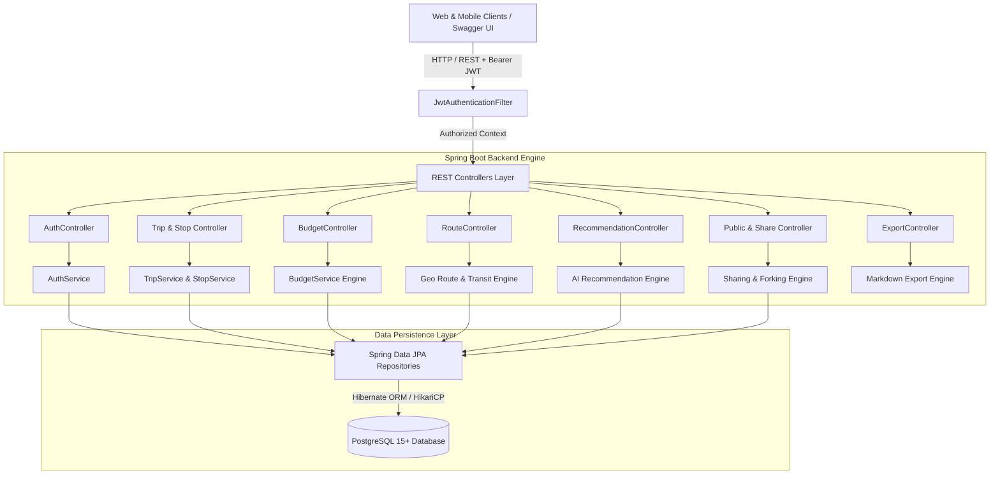
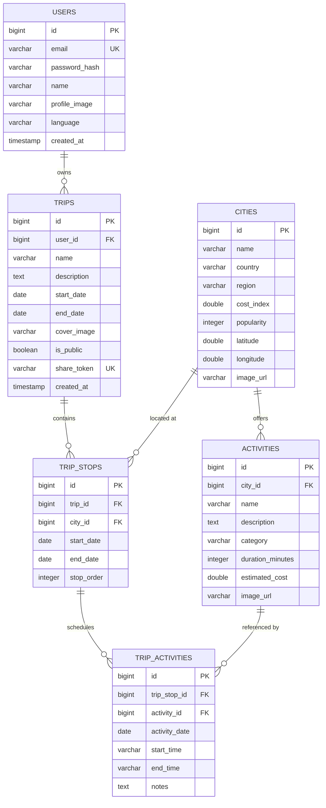

<div align="center">

# 🌍 GlobeTrotter
### *Empowering Intelligent, Personalized & Collaborative Multi-City Travel Planning*

[](https://openjdk.org/)
[](https://spring.io/projects/spring-boot)
[](https://www.postgresql.org/)
[](https://spring.io/projects/spring-security)
[](http://localhost:8080/swagger-ui/index.html)
[](LICENSE)

<p align="center">
  <b>Dream. Design. Calculate. Explore. Share.</b><br>
  An enterprise-grade, RESTful backend engine powering modern multi-city trip creation, real-time budgeting, geographic transit routing, and AI-assisted destination recommendations.
</p>

[Explore API Docs (Swagger UI)](http://localhost:8080/swagger-ui/index.html) • [Key Features](#-key-features) • [Architecture](#-system-architecture) • [Quickstart](#-quickstart-guide) • [API Reference](#-live-api-reference)

---

</div>

## 📌 Executive Summary & Pitch Description

> **Short Description (for Hackathon / Devpost / LinkedIn):**
> 
> *GlobeTrotter is a full-stack, intelligent travel planning platform designed to eliminate the chaos of spreadsheets and fragmented booking apps. Built with Java 21, Spring Boot 3, and PostgreSQL, GlobeTrotter empowers travelers to effortlessly construct multi-city itineraries, calculate granular budgets across tiers and global currencies in real-time, compute multi-modal geographic transit routes (high-speed rail, flights, drives), receive smart proximity-based destination recommendations, and share or fork itineraries with a single click.*

### 🎯 The Problem
Planning multi-city travel is notoriously complex. Travelers juggle multiple booking tabs, confusing currency conversions, disconnected map pins, and unpredictable expenses. Existing platforms either offer rigid pre-packaged tours or basic search lists without structured itinerary logic or unified financial visibility.

### 💡 The Solution
GlobeTrotter provides an end-to-end travel platform combining **relational itinerary modeling**, **smart real-time financial estimation**, **geo-spatial transit routing**, and **viral social collaboration**.

---

## ✨ Key Features

### 🔐 1. Robust Security & Authentication
- **Stateless JWT Architecture**: Secure 24-hour signed JWT Bearer Tokens with `HMAC-SHA512`.
- **BCrypt Encryption**: Passwords salted and hashed with Spring Security 6.
- **User Data Isolation**: Multi-tenant data segregation ensuring trips and private budgets are strictly accessible only to their owners.

### 🏙️ 2. Global Destination & Activity Catalogue
- **Pre-Seeded Top Global Cities**: Coordinates (`lat`/`lng`), cost index metrics (1.0 to 5.0), and popularity ratings.
- **Curated Multi-Category Activities**: Rich activities categorized by `Sightseeing`, `Culture`, `Food`, `Adventure`, `Nature`, `Entertainment`, and `Shopping`.
- **Full-Text Filtering**: Instant city and activity discovery by keyword and category.

### 🗓️ 3. Interactive Multi-Stop Itinerary Builder
- **Flexible Sequential Stops**: Add and manage city stops with dedicated arrival/departure timeframes.
- **Drag-and-Drop Reordering**: Dedicated reorder endpoint (`PUT /api/trips/{id}/stops/reorder`) updates stop sequences seamlessly.
- **Granular Activity Scheduling**: Attach specific activities to stops with custom start/end time slots and private traveler notes.

### 💰 4. Real-Time Dynamic Budget Engine
- **Multi-Tier Multipliers**: Compute cost breakdowns dynamically for **Budget**, **Standard**, and **Luxury** travel tiers.
- **Algorithmic Estimation**:
  $$\text{Accommodation} = \text{TierBase} \times \text{CityCostIndex} \times \text{Days}$$
  $$\text{Food \& Dining} = \text{TierBase} \times \text{CityCostIndex} \times \text{Days}$$
  $$\text{Local Transport} = \text{TierBase} \times \text{CityCostIndex} \times \text{Days}$$
  $$\text{Activities Total} = \sum \text{Selected Activity Ticket Prices}$$
- **Multi-Currency Support**: Real-time conversion across `USD`, `EUR`, `GBP`, `JPY`, `INR`, `CAD`, and `AUD`.
- **Categorical Percentages**: Visual percentage distribution across lodging, dining, transit, and experiences.

### 🗺️ 5. Multi-City Geo Route Engine
- **Haversine Great-Circle Calculations**: Exact transit distance calculations between consecutive stops in both kilometers and miles.
- **Multi-Modal Transit Recommendations**:
  - `< 150 km`: Regional Drive / Bus with time estimates.
  - `150 – 800 km`: High-Speed Rail with estimated travel duration and transit fare.
  - `> 800 km`: Commercial Flight routing with airport buffer adjustments.
- **Polyline Arc Coordinates**: Intermediate curve waypoints ready for **Leaflet**, **Mapbox**, or **Google Maps** visualization.

### 🤖 6. Smart AI Recommendation Engine
- **Proximity & Region Matchmaking**: Scores potential next destinations (0–100%) by evaluating geographical distance from existing stops, shared continents/regions, and budget alignment.
- **Activity Curation**: Recommends top-rated unadded experiences matching user preference tags (`Food`, `Culture`, `Adventure`, `Nature`).

### 🔗 7. Viral Social Collaboration & Itinerary Forking
- **1-Click Public Link Sharing**: Generates unique, tamper-proof UUID share tokens.
- **Unauthenticated Public Viewer**: Friends and community members can view itineraries without creating an account.
- **Itinerary Forking / Cloning**: Authenticated users can clone any public itinerary directly into their account with a single request.

### 📄 8. One-Click Markdown & Text Export
- Generate clean, beautifully formatted **Markdown travel guides** complete with schedule timelines and markdown budget comparison tables.

---

## 🏛️ System Architecture



---

## 🗄️ Relational Database Schema (ERD)



---

## 📡 Live API Reference

### 🔐 Authentication (`/api/auth`)
| Method | Endpoint | Description | Auth |
|:---|:---|:---|:---|
| `POST` | `/api/auth/signup` | Register new user account | Public |
| `POST` | `/api/auth/login` | Login and receive Bearer JWT token | Public |
| `GET` | `/api/auth/me` | Fetch authenticated user profile | Bearer JWT |

### 🏙️ Exploration (`/api/cities`, `/api/activities`)
| Method | Endpoint | Description | Auth |
|:---|:---|:---|:---|
| `GET` | `/api/cities` | List all available global cities | Public |
| `GET` | `/api/cities/search?keyword=...` | Search destinations by keyword | Public |
| `GET` | `/api/cities/{id}` | Get city details with activities | Public |
| `GET` | `/api/activities/city/{cityId}` | Filter activities by city & category | Public |
| `GET` | `/api/activities/search?query=...` | Search activities across all cities | Public |

### 🗓️ Itineraries & Stops (`/api/trips`)
| Method | Endpoint | Description | Auth |
|:---|:---|:---|:---|
| `POST` | `/api/trips` | Create a new trip | Bearer JWT |
| `GET` | `/api/trips` | List all trips for current user | Bearer JWT |
| `GET` | `/api/trips/{id}` | Get trip with nested stops & activities | Bearer JWT |
| `PUT` | `/api/trips/{id}` | Update trip title, description, or dates | Bearer JWT |
| `DELETE` | `/api/trips/{id}` | Delete trip | Bearer JWT |
| `POST` | `/api/trips/{id}/stops` | Add a city stop to trip | Bearer JWT |
| `PUT` | `/api/trips/{id}/stops/{stopId}` | Update stop dates | Bearer JWT |
| `DELETE` | `/api/trips/{id}/stops/{stopId}` | Remove stop from trip | Bearer JWT |
| `PUT` | `/api/trips/{id}/stops/reorder` | Reorder stop sequence | Bearer JWT |
| `POST` | `/api/trips/{id}/stops/{stopId}/activities` | Assign activity to stop | Bearer JWT |
| `DELETE` | `/api/trips/{id}/stops/{stopId}/activities/{taId}` | Remove activity from stop | Bearer JWT |

### 💰 Budget & Financials (`/api/trips/{id}/budget`)
| Method | Endpoint | Description | Auth |
|:---|:---|:---|:---|
| `GET` | `/api/trips/{id}/budget` | Real-time budget calculation (`?tier=standard&currency=USD`) | Bearer JWT |
| `GET` | `/api/trips/{id}/budget/currencies` | List supported currencies and exchange rates | Bearer JWT |

### 🗺️ Route & Geo-Visualization (`/api/trips/{id}/route`)
| Method | Endpoint | Description | Auth |
|:---|:---|:---|:---|
| `GET` | `/api/trips/{id}/route` | GeoJSON waypoints, transit modes, and distance | Bearer JWT |

### 🤖 Smart AI Recommendations (`/api/trips/{id}/recommendations`)
| Method | Endpoint | Description | Auth |
|:---|:---|:---|:---|
| `GET` | `/api/trips/{id}/recommendations/cities` | Contextual next-city suggestions | Bearer JWT |
| `GET` | `/api/trips/{id}/recommendations/activities` | Personalized activity suggestions | Bearer JWT |

### 🔗 Public Sharing & Forking (`/api/trips/{id}/share`, `/api/public/trips`)
| Method | Endpoint | Description | Auth |
|:---|:---|:---|:---|
| `POST` | `/api/trips/{id}/share` | Enable public sharing and generate share token | Bearer JWT |
| `DELETE` | `/api/trips/{id}/share` | Revoke public sharing | Bearer JWT |
| `GET` | `/api/public/trips/{shareToken}` | Public view of itinerary without auth | Public |
| `POST` | `/api/public/trips/{shareToken}/fork` | Clone someone's public trip into user account | Bearer JWT |

### 📄 Export (`/api/trips/{id}/export`)
| Method | Endpoint | Description | Auth |
|:---|:---|:---|:---|
| `GET` | `/api/trips/{id}/export/markdown` | Download formatted Markdown travel guide | Bearer JWT |
| `GET` | `/api/trips/{id}/export/text` | Download plain-text itinerary | Bearer JWT |

---

## 🚀 Quickstart Guide

### Prerequisites
- **Java 21 JDK** (`java -version`)
- **Apache Maven 3.8+** (`mvn -v`)
- **PostgreSQL 14+** running on `localhost:5432` or `localhost:5433`

### 1. Clone the Repository
```bash
git clone https://github.com/sujalvarecha/GlobeTrotter.git
cd GlobeTrotter/backend
```

### 2. Configure Database
Ensure PostgreSQL is active with a database named `globetrotter_db`.
Check or modify `src/main/resources/application.yml`:
```yaml
spring:
  datasource:
    url: jdbc:postgresql://localhost:5433/globetrotter_db
    username: postgres
    password: password # or empty if using local trust authentication
  jpa:
    hibernate:
      ddl-auto: update
```

### 3. Build & Run
```bash
# Compile and package
mvn clean compile

# Run Spring Boot application
mvn spring-boot:run
```

The server will start at **`http://localhost:8080`**.
On startup, `DataInitializer` automatically pre-populates PostgreSQL with global cities, activities, and coordinates!

### 4. Open Interactive Swagger UI
Visit in your browser:
👉 **[http://localhost:8080/swagger-ui/index.html](http://localhost:8080/swagger-ui/index.html)**

---

## 🧪 Sample cURL Walkthrough

```bash
# 1. Register & get JWT Token
TOKEN=$(curl -s -X POST http://localhost:8080/api/auth/signup \
  -H "Content-Type: application/json" \
  -d '{"name":"Alex Explorer","email":"alex@example.com","password":"password123"}' \
  | python3 -c "import sys,json; print(json.load(sys.stdin)['accessToken'])")

# 2. Create a Trip
TRIP_ID=$(curl -s -X POST http://localhost:8080/api/trips \
  -H "Content-Type: application/json" \
  -H "Authorization: Bearer $TOKEN" \
  -d '{"name":"European Summer Odyssey","description":"Paris to Venice and Rome","startDate":"2026-07-01","endDate":"2026-07-12"}' \
  | python3 -c "import sys,json; print(json.load(sys.stdin)['id'])")

# 3. Add Paris Stop
curl -s -X POST http://localhost:8080/api/trips/$TRIP_ID/stops \
  -H "Content-Type: application/json" \
  -H "Authorization: Bearer $TOKEN" \
  -d '{"cityId":1,"startDate":"2026-07-01","endDate":"2026-07-05"}'

# 4. Get Dynamic Budget (in EUR, Luxury Tier)
curl -s "http://localhost:8080/api/trips/$TRIP_ID/budget?tier=luxury&currency=EUR" \
  -H "Authorization: Bearer $TOKEN"

# 5. Export Markdown Itinerary
curl -s "http://localhost:8080/api/trips/$TRIP_ID/export/markdown" \
  -H "Authorization: Bearer $TOKEN"
```

---

## 👥 Team & Acknowledgments

Developed with ❤️ for the Hackathon.

- **Backend Architecture & Engineering:** [GlobeTrotter Team](https://github.com/sujalvarecha/GlobeTrotter)
- **Built with:** Java 21 • Spring Boot 3 • PostgreSQL • Hibernate • Spring Security • JWT • Swagger UI
