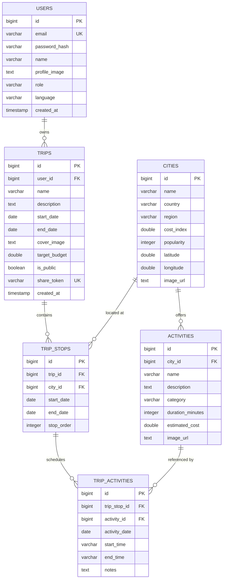

<div align="center">

# 🌍 GlobeTrotter
### *Intelligent, Multi-City Travel Planning & Collaborative Exploration Engine*

[](https://react.dev/)
[](https://vitejs.dev/)
[](https://tailwindcss.com/)
[](https://openjdk.org/)
[](https://spring.io/projects/spring-boot)
[](https://supabase.com/)
[](https://spring.io/projects/spring-security)
[](http://localhost:8080/swagger-ui/index.html)
[](LICENSE)

<p align="center">
  <b>Dream. Design. Calculate. Explore. Share.</b><br>
  A modern, full-stack travel platform combining an airport departure-board user experience with real-time financial budgeting, interactive Leaflet route maps, calendar timetables, on-the-fly AI itinerary synthesis, and viral social collaboration.
</p>

[Live Web App (Port 5173)](http://localhost:5173) • [API Swagger Docs](http://localhost:8080/swagger-ui/index.html) • [Key Features](#-key-features) • [Architecture](#-system-architecture) • [Quickstart Guide](#-quickstart-guide) • [API Reference](#-live-api-reference)

---

</div>

## 📌 Executive Summary & Project Pitch

> **Project Pitch:**
> 
> *GlobeTrotter is a full-stack, intelligent travel planning platform engineered to eliminate the fragmentation of spreadsheets, multi-tab booking portals, and rigid tour packages. Featuring a bespoke "Airport Departure Board & Boarding Pass" design language, GlobeTrotter empowers travelers to construct multi-city itineraries, calculate granular budgets across global currencies in real-time, compute multi-modal geographic transit routes (high-speed rail, flights, scenic drives), synthesize tailored itineraries anywhere on Earth with AI, and share or fork trips with a single click.*

### 🎯 The Problem
Planning multi-city journeys is traditionally disorganized. Travelers juggle conflicting browser tabs, complex currency conversions, disconnected map pins, and unexpected expenses. Most existing platforms either offer inflexible pre-packaged tours or basic search lists without relational itinerary structuring, calendar timetables, or unified financial visibility.

### 💡 The Solution
GlobeTrotter provides an integrated, end-to-end travel platform combining:
1. **Bespoke Boarding-Pass UI/UX**: Perforated ticket stubs, monospace tabular flight numerals, departure flip-boards, and dual **Light / Dark Mode** theme toggle.
2. **Dynamic AI Synthesis Engine**: Generates customized itineraries and activities for **any location worldwide** and dynamically saves them into the cloud database.
3. **Interactive Geo-Spatial Route Engine**: Leaflet maps with great-circle arc curves, waypoint routing, and transit calculations.
4. **Algorithmic Real-Time Budgeting**: Multi-tier multipliers (Budget, Standard, Luxury) and live FX currency conversion across 7 global currencies.
5. **Interactive Day-by-Day Trip Calendar**: Multi-view timetable (Month, Week, Day, Agenda) with popup activity details.
6. **Viral Social Sharing & 1-Click Forking**: Tamper-proof public itineraries cloneable directly into personal accounts.

---

## ✨ Key Features & Capabilities

### 🎨 1. "Boarding Pass & Departure Board" Design System
- **Aesthetic Immersion**: Styled after airport terminal departure boards with live flip-status indicators (`ON TIME`, `BOARDING`, `FINAL CALL`).
- **Ticket Stub Cards**: Custom perforated edges, ticket serials, flight path lines, and gold amber accents.
- **☀️ Light / 🌙 Dark Mode**: Global theme switcher with seamless CSS token transitions and `localStorage` persistence.

### 🤖 2. Universal AI Travel Wizard & Dynamic Destination Engine
- **Universal Knowledge Base**: Pre-seeded with 35+ major travel hubs across India (Mumbai, Delhi, Jaipur, Goa, Hyderabad, Chennai, Kolkata, Udaipur, Varanasi, Bengaluru, Kochi, Agra, Manali, Ladakh, Amritsar) and the world (Paris, Tokyo, Rome, Venice, London, New York, Bali, Dubai, Singapore, Bangkok, Amsterdam, Sydney, Cairo, Rio de Janeiro, Santorini, Zurich, Seoul, Cape Town, Queenstown).
- **On-The-Fly AI Synthesis Engine**: When a traveler queries *any* destination globally (even unlisted towns or regions), the engine dynamically synthesizes realistic GPS coordinates, cost indices, cover imagery, and personalized activities matching the traveler's interests, persisting them into Supabase in real-time.

### 🗺️ 3. Interactive Multi-City Geographic Route Map
- **Leaflet & OpenStreetMap Integration**: Visualizes sequential multi-city journeys with interactive custom airport markers.
- **Great-Circle Curved Arcs**: Haversine distance computations displayed in both kilometers and miles.
- **Multi-Modal Transit Predictions**:
  - `< 150 km`: Regional Drive / Scenic Bus duration & fuel estimates.
  - `150 – 800 km`: High-Speed Rail route duration & fare estimate.
  - `> 800 km`: Commercial Flight flight time with airport buffer adjustments.

### 📅 4. Interactive Day-by-Day Trip Calendar
- **Multi-View Timetable**: Seamlessly switch between **Month**, **Week**, **Day**, and **Agenda** views.
- **Auto-Sync to Trip Dates**: Switching to the Calendar tab immediately navigates to your scheduled departure date.
- **Activity Detail Spotlight**: Clicking any scheduled event opens an interactive popup displaying start/end times, location, estimated cost in INR/USD, category badges, and personal traveler notes.

### 💰 5. Real-Time Dynamic Budget Engine
- **Multi-Tier Multipliers**: Compute cost breakdowns dynamically for **Budget**, **Standard**, and **Luxury** comfort tiers.
- **Algorithmic Estimation Model**:
  $$\text{Accommodation} = \text{TierBase} \times \text{CityCostIndex} \times \text{Days}$$
  $$\text{Food \& Dining} = \text{TierBase} \times \text{CityCostIndex} \times \text{Days}$$
  $$\text{Local Transport} = \text{TierBase} \times \text{CityCostIndex} \times \text{Days}$$
  $$\text{Activities Total} = \sum \text{Selected Activity Ticket Prices}$$
- **Multi-Currency Converter**: Instant conversion across `USD ($)`, `EUR (€)`, `GBP (£)`, `JPY (¥)`, `INR (₹)`, `CAD ($)`, and `AUD ($)`.
- **Categorical Breakdown**: Visual breakdown across lodging, dining, transit, and experiences.

### 🏙️ 6. Interactive Trending Destinations Spotlight
- **Actionable Destination Cards**: Click any trending city on the dashboard to open the **Destination Spotlight Modal**.
- **Instant Actions**:
  - **"✨ AI Generate Trip"**: Pre-fills the destination into the AI Wizard and starts synthesis.
  - **"+ Custom Trip"**: Direct navigation with destination and high-res cover photos pre-loaded.

### 🖼️ 7. Client-Side Image Scaler & Custom Uploads
- **High-Res Photo Resizer**: Built-in HTML5 canvas image compressor that scales camera photos to clean, web-safe base64 images, eliminating database column limits.
- **Online Image URL Option**: Direct URL input toggle for instant web cover image binding.

### 🔐 8. Role-Based Access Control & Admin Dashboard
- **Stateless JWT Security**: Secure 24-hour signed JWT Bearer Tokens with `HMAC-SHA512` and BCrypt password encryption.
- **Multi-Tenant Data Segregation**: Private itineraries and budgets accessible strictly to their owners.
- **Admin Management Console (`/admin`)**: Restricted exclusively to administrators (`ROLE_ADMIN`), providing live user statistics and platform metrics.

### 🔗 9. Viral Social Sharing & Itinerary Forking
- **1-Click Public Link**: Generates unique, tamper-proof UUID share tokens (`/share/{shareToken}`).
- **Unauthenticated Public Viewer**: Friends and community members can explore complete itineraries with route maps and cost breakdowns without signing in.
- **1-Click Clone / Forking**: Authenticated travelers can fork any shared itinerary directly into their account.

### 📄 10. One-Click Markdown & Text Export
- Export clean, beautifully formatted **Markdown travel guides** complete with schedule timelines and markdown budget comparison tables for offline travel.

---

## 🏛️ System Architecture

```mermaid
graph TD
    Client["Frontend Web App (React 19 + Vite + Tailwind v4 + Framer Motion)"]
    
    subgraph Security & API Gateway
        Client -->|HTTP / REST + Bearer JWT| SecurityFilter["JwtAuthenticationFilter"]
        SecurityFilter -->|Authorized Context (ROLE_USER / ROLE_ADMIN)| Controllers["Spring Boot REST API"]
    end

    subgraph Service & Engine Layer
        Controllers --> AuthCtrl["Auth & User Management"]
        Controllers --> TripCtrl["Itinerary & Stop Management"]
        Controllers --> AICtrl["AI Wizard & Destination Synthesizer"]
        Controllers --> BudgetCtrl["Dynamic Budget Engine"]
        Controllers --> RouteCtrl["Geo Route & Transit Engine"]
        Controllers --> ShareCtrl["Social Sharing & Forking"]
        Controllers --> AdminCtrl["Admin Operations & Metrics"]
        Controllers --> ExportCtrl["Markdown Travel Guide Exporter"]
    end

    subgraph Cloud Persistence Layer
        Controllers --> Repos["Spring Data JPA / Hibernate ORM"]
        Repos -->|HikariCP Connection Pool| SupabaseDB[("Supabase PostgreSQL Database")]
    end
```

---

## 🗄️ Database Entity-Relationship Diagram (ERD)



---

## 🚀 Quickstart Guide

### Prerequisites
- **Node.js 18+** & **npm** (`node -v`, `npm -v`)
- **Java 17 or 21 JDK** (`java -version`)
- **Apache Maven 3.8+** (or use included `./mvnw`)

---

### 1. Clone the Repository
```bash
git clone https://github.com/sujalvarecha/GlobeTrotter.git
cd GlobeTrotter
```

---

### 2. Launch the Spring Boot Backend Server
```bash
cd backend

# Run with Maven Wrapper (connects directly to Supabase cloud DB)
./mvnw spring-boot:run
```
*The backend server will start on **`http://localhost:8080`**. On initial startup, `DataInitializer` automatically seeds 35+ global destinations and the default Admin account.*

---

### 3. Launch the React Frontend Application
Open a new terminal tab in the project root:
```bash
# Install frontend dependencies
npm install

# Start the Vite development server
npm run dev
```
*The frontend web application will start at **`http://localhost:5173`**.*

---

## 🔑 Demo Accounts & Credentials

| Role | Email | Password | Access Level |
|:---|:---|:---|:---|
| **⚡ Admin** | `admin@globetrotter.io` | `AdminPass123!` | Full Platform + `/admin` Console |
| **✈ Traveler** | `traveler@globetrotter.io` | `Traveler123!` | Standard Traveler Planning |

---

## 📡 Live API Reference

### 🔐 Authentication (`/api/auth`)
| Method | Endpoint | Description | Auth |
|:---|:---|:---|:---|
| `POST` | `/api/auth/signup` | Register new user account | Public |
| `POST` | `/api/auth/login` | Login and receive Bearer JWT token | Public |
| `GET` | `/api/auth/me` | Fetch authenticated user profile | Bearer JWT |

### ✨ AI Wizard & Synthesis (`/api/ai`)
| Method | Endpoint | Description | Auth |
|:---|:---|:---|:---|
| `POST` | `/api/ai/generate-itinerary` | Synthesize complete itinerary for any destination with auto-persistence | Bearer JWT |

### 🏙️ Exploration (`/api/cities`, `/api/activities`)
| Method | Endpoint | Description | Auth |
|:---|:---|:---|:---|
| `GET` | `/api/cities` | List all global cities | Public |
| `GET` | `/api/cities/search?keyword=...` | Search destinations by keyword | Public |
| `GET` | `/api/cities/{id}` | Get city details with activities | Public |
| `GET` | `/api/activities/city/{cityId}` | Filter activities by city & category | Public |
| `GET` | `/api/activities/search?query=...` | Search activities across all cities | Public |

### 🗓️ Itineraries & Stops (`/api/trips`)
| Method | Endpoint | Description | Auth |
|:---|:---|:---|:---|
| `POST` | `/api/trips` | Create a new trip | Bearer JWT |
| `GET` | `/api/trips` | List all trips for current user | Bearer JWT |
| `GET` | `/api/trips/{id}` | Get trip with nested stops & activities | Bearer JWT |
| `PUT` | `/api/trips/{id}` | Update trip title, description, or dates | Bearer JWT |
| `DELETE` | `/api/trips/{id}` | Delete trip | Bearer JWT |
| `POST` | `/api/trips/{id}/stops` | Add a city stop to trip | Bearer JWT |
| `PUT` | `/api/trips/{id}/stops/{stopId}` | Update stop dates | Bearer JWT |
| `DELETE` | `/api/trips/{id}/stops/{stopId}` | Remove stop from trip | Bearer JWT |
| `PUT` | `/api/trips/{id}/stops/reorder` | Reorder stop sequence | Bearer JWT |
| `POST` | `/api/trips/{id}/stops/{stopId}/activities` | Assign activity to stop | Bearer JWT |
| `DELETE` | `/api/trips/{id}/stops/{stopId}/activities/{taId}` | Remove activity from stop | Bearer JWT |

### 💰 Budget & Financials (`/api/trips/{id}/budget`)
| Method | Endpoint | Description | Auth |
|:---|:---|:---|:---|
| `GET` | `/api/trips/{id}/budget` | Real-time budget calculation (`?tier=standard&currency=USD`) | Bearer JWT |
| `GET` | `/api/trips/{id}/budget/currencies` | List supported currencies and exchange rates | Bearer JWT |

### 🗺️ Route & Geo-Visualization (`/api/trips/{id}/route`)
| Method | Endpoint | Description | Auth |
|:---|:---|:---|:---|
| `GET` | `/api/trips/{id}/route` | GeoJSON waypoints, transit modes, and distance | Bearer JWT |

### 🤖 Smart Recommendations (`/api/trips/{id}/recommendations`)
| Method | Endpoint | Description | Auth |
|:---|:---|:---|:---|
| `GET` | `/api/trips/{id}/recommendations/cities` | Contextual next-city suggestions | Bearer JWT |
| `GET` | `/api/trips/{id}/recommendations/activities` | Personalized activity suggestions | Bearer JWT |

### 🔗 Public Sharing & Forking (`/api/trips/{id}/share`, `/api/public/trips`)
| Method | Endpoint | Description | Auth |
|:---|:---|:---|:---|
| `POST` | `/api/trips/{id}/share` | Enable public sharing and generate share token | Bearer JWT |
| `DELETE` | `/api/trips/{id}/share` | Revoke public sharing | Bearer JWT |
| `GET` | `/api/public/trips/{shareToken}` | Public view of itinerary without auth | Public |
| `POST` | `/api/public/trips/{shareToken}/fork` | Clone someone's public trip into user account | Bearer JWT |

### ⚡ Admin & Metrics (`/api/admin`)
| Method | Endpoint | Description | Auth |
|:---|:---|:---|:---|
| `GET` | `/api/admin/stats` | Platform statistics, total users & trip metrics | `ROLE_ADMIN` |

### 📄 Export (`/api/trips/{id}/export`)
| Method | Endpoint | Description | Auth |
|:---|:---|:---|:---|
| `GET` | `/api/trips/{id}/export/markdown` | Download formatted Markdown travel guide | Bearer JWT |
| `GET` | `/api/trips/{id}/export/text` | Download plain-text itinerary | Bearer JWT |

---

## 👥 Tech Stack Summary

- **Frontend:** React 19, Vite 6, Tailwind CSS v4, Framer Motion, Lucide Icons, Leaflet / OpenStreetMap, React Big Calendar, Zustand, Axios.
- **Backend:** Java 17 / 21, Spring Boot 3.2, Spring Security 6, Spring Data JPA, Hibernate ORM, JJWT, HikariCP, SpringDoc OpenAPI (Swagger 3).
- **Database:** Supabase PostgreSQL with automated schema migrations.

Developed with ❤️ for the Hackathon.
